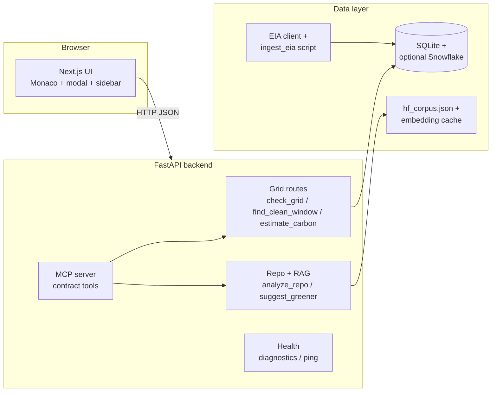

Here's the revised plan where both people work **full-stack** (each owns a self-contained vertical slice), and the first 1–2 steps are fully independent so neither person is blocked waiting on the other.

**Also read:** **`README.md` §0** (canonical doc index), **`README.md` §5** (API JSON contract), and **`a.md`** (Person A — §0 required ship, sponsors **Brev / AWS / GCP**, datasets, implementation details).

---

# GridGreen — Revised Work Split

## Core Philosophy Change

Instead of A=backend, B=frontend, each person owns **one complete feature end-to-end** — their own FastAPI route(s) + their own UI component(s). No coordination needed until integration at hour 14.

---

## 👤 Person A — Grid Intelligence Slice
*"When should I run?"*

Owns: Grid forecasting, carbon estimation, the pre-run modal UI, and the Monaco inline annotations.

**API routes:** `/check_grid`, `/find_clean_window`, `/estimate_carbon`
**UI:** Monaco editor panel + inline decorations + pre-run modal with 48h chart

---

## 👤 Person B — Model Intelligence Slice
*"What should I run?"*

Owns: RAG-based model suggestions, Gemini NL reasoning, the suggestion sidebar UI, stats card, and MCP/config page.

**API routes:** `/suggest_greener`, `/scorecard`
**UI:** Sidebar suggestion cards + stats card + `/mcp` config page

---

## Phase 1: Setup (Hours 0–2) — **Fully Independent**

Both people can do this simultaneously with zero dependency on each other.

**Person A:**
- [ ] Create GitHub repo `gridgreen/`, add `backend/` + `frontend/` scaffolds, share access
- [ ] Register EIA API key (instant at eia.gov/opendata)
- [ ] Request Brev.dev GPU **now** (async, takes 1–3h — fire and forget)
- [ ] Create Snowflake + Databricks accounts, save credentials to `.env`
- [ ] Scaffold FastAPI app: `main.py`, uvicorn running locally on :8000, health check at `/ping` returns `{"ok": true}`

**Person B:**
- [ ] Scaffold Next.js + Tailwind, `npm run dev` running locally
- [ ] Deploy empty Next.js page to Vercel (takes 5 min) — get a live URL
- [ ] Create Gemini + W&B accounts, save API keys
- [ ] Set up Notion board: 3 columns (Doing / Blocked / Done), both people added
- [ ] Write `CONTRACT.md` (paste the API contract from §5 of the original doc) and commit it

**Checkpoint:** Both have independent running environments. No merge needed yet. Repo exists. Contract locked.

---

## Phase 2: Foundation (Hours 2–8) — **Still Independent**

Each person builds their slice with hardcoded/stub responses first, then replaces with real logic.

**Person A (6h) — Grid slice:**
- [ ] `POST /estimate_carbon` — hardcoded contract-valid JSON response (30 min)
- [ ] `GET /check_grid` — hardcoded (30 min)
- [ ] `GET /find_clean_window` — hardcoded (30 min)
- [ ] Deploy backend to Render → public URL (1h)
- [ ] Pull 30 days EIA hourly data for 5 regions (CISO, ERCO, PJM, MISO, NYIS), load into Snowflake (1.5h)
- [ ] Main page layout: Monaco editor left panel + stub "Run Analysis" button, wire to `/estimate_carbon`, render raw JSON (2h)
- [ ] Sample ML training script as Monaco default content (15 min)

**Person B (6h) — Model slice:**
- [ ] `POST /suggest_greener` — hardcoded contract-valid JSON (30 min)
- [ ] `GET /scorecard` — hardcoded (30 min)
- [ ] Build right sidebar in Next.js: suggestion cards rendering hardcoded JSON from `/suggest_greener` (2h)
- [ ] Stats card component rendering hardcoded scorecard numbers (1h)
- [ ] Design system: define CSS variables, color palette, typography, spacing — apply to both panels (2h)

**Checkpoint:** Each person has a working end-to-end slice with fake data. Both can demo their own slice independently.

---

## Phase 3: Integration + Real Intelligence (Hours 8–14) — **First Merge**

Pull each other's branches. Now you're building on a shared codebase.

**Person A (6h):**
- [ ] Grid forecasting model — Prophet on EIA Snowflake data, 48h horizon (1.5h)
- [ ] Replace `/check_grid` + `/find_clean_window` stubs with real predictions (1h)
- [ ] Rules-based carbon estimator: HF model lookup table + GPU multipliers (2h)
- [ ] Replace `/estimate_carbon` stub with real estimator (30 min)
- [ ] Monaco inline decorations — highlight detected `model.fit`, `AutoModel`, `Trainer` lines with carbon impact badges (1h)

**Person B (6h):**
- [ ] Pre-run modal: wire to `/find_clean_window`, render 48h Recharts line graph, show "1.84kg now vs 340g at 3am" numbers (2.5h)
- [ ] Framer Motion: modal open/close transition + card stagger reveal (45 min)
- [ ] Polish sidebar: citation chip, "Apply suggestion" button (replaces snippet inline), hover states (1.5h)
- [ ] Wire stats card to live `/scorecard` endpoint (45 min)
- [ ] Loading spinners + error states for all API calls (30 min)

**Checkpoint @ hour 14:** Real estimates inline. Real 48h forecast chart. Suggestion cards show real structure. **Both sleep.**

---

## Phase 4: Sleep (Hours 14–22)

Staggered: Person A sleeps 14–20, Person B sleeps 15–22. Someone always online for service outages. Low-intensity only if awake: Devpost copy, CSS polish, small visual fixes. No risky work.

---

## Phase 5: Intelligence Layer (Hours 22–28)

**Person A (6h):**
- [ ] RAG index: scrape 30 HF model card pairs, embed on Brev.dev GPU, store as VECTOR in Snowflake Cortex (2.5h)
- [ ] Wire `/suggest_greener`: model name extraction from code → Cortex similarity search → return alternatives (1.5h)
- [ ] Databricks Delta Live Tables pipeline for EIA stream (1.5h)
- [ ] Run reference workload on Brev.dev, capture W&B experiment screenshot (30 min)

**Person B (6h):**
- [ ] Gemini API: reads Cortex-retrieved context, generates NL reasoning paragraph per suggestion (2h)
- [ ] Render Gemini reasoning in modal below the 48h chart (1h)
- [ ] `/mcp` config page: Claude Desktop JSON config + copy button (1h)
- [ ] Architecture diagram in Figma (1h)
- [ ] MCP server wiring: expose all 5 tools via FastAPI MCP endpoint, test in Claude Desktop (1h)

**Checkpoint:** Every feature works. Every sponsor tech visibly used.

---

## Phase 6: Polish + Demo (Hours 28–32)

**Person A (4h):**
- [ ] Test MCP in Claude Desktop end-to-end (1h)
- [ ] Log W&B experiment, screenshot (30 min)
- [ ] Write technical Devpost description (1.5h)
- [ ] Fix any backend bugs from demo run-through (1h)

**Person B (4h):**
- [ ] Record 3-min demo video (1.5h including retakes — see §9)
- [ ] Write user-facing Devpost description (1h)
- [ ] Devpost header image (30 min)
- [ ] Submit on Devpost, select ALL prize categories (1h)

---

## Phase 7: Buffer + Rehearsal (Hours 32–36)

**Both (1.5h each):**
- [ ] Rehearse pitch out loud ×3
- [ ] Test live demo on clean incognito browser
- [ ] Confirm backup video plays in browser tab
- [ ] Critical bug fixes only — strict 15 min cap

---

## What Changed vs the Original Split

| Original | Revised |
|---|---|
| A = all backend, B = all frontend | Each person owns full-stack slices |
| B couldn't start UI until A deployed the API | Both scaffold independently in Phase 1 |
| A had no frontend work | A owns Monaco editor + pre-run modal |
| B had no backend work | B owns RAG routes + Gemini integration |
| Single point of failure if one person gets stuck | Each slice is demooable standalone |
| Integration only happens at the end | First integration at hour 8, not hour 24 |

---

The key insight: **each person's slice is a complete user story.** Person A's demo is "paste code → see when to run." Person B's demo is "see what cheaper model to use → apply it." Together it's the full product. Neither is a dependency for the other until Phase 3.

---

## Runtime architecture (high level)

EIA hourly rows flow **EIA API (or mock) → `storage.insert_eia_rows` → SQLite**,
then grid endpoints read through the storage facade for forecasts.
